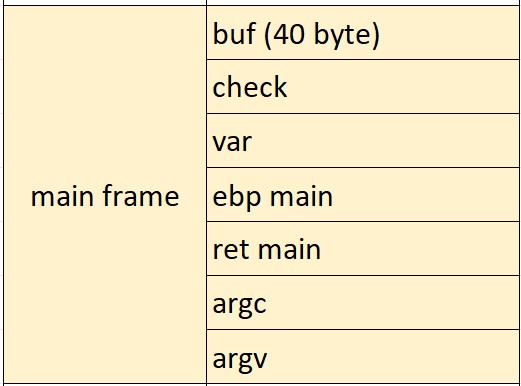
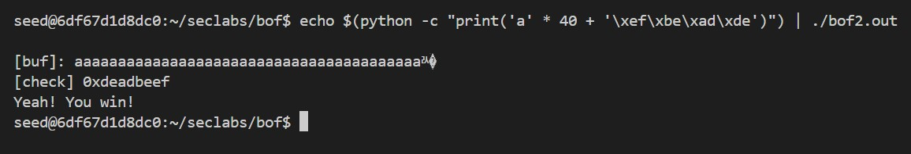

# BUFFER OVER FLOW 2
> Target: Print "Yeah! You win!".
```
#include <stdlib.h>
#include <stdio.h>

void main(int argc, char *argv[])
{
  int var;
  int check = 0x04030201;
  char buf[40];

  fgets(buf,45,stdin);

  printf("\n[buf]: %s\n", buf);
  printf("[check] 0x%x\n", check);

  if ((check != 0x04030201) && (check != 0xdeadbeef))
    printf ("\nYou are on the right way!\n");

  if (check == 0xdeadbeef)
   {
     printf("Yeah! You win!\n");
   }
}
```

### Step 1: Analyze the code.
To be honest, the  target of this task is easier than task 1 - bof1.  
**fgets()** is a more advanced function than **gets()** for having user's input, as you can easily to guess that this function can handle the input length by looking at the code.

In this situation, there's an error in the program. The **fgets()** function gets the user's input more than the size of the buffer, up tp 45 bytes, when the size of buffer is only 40 bytes.  
We will make use this error to change the *check*'s data.

### Step 2: Conduct the attack.
Take a look at the stack frame:



Our aim now is to overflow the data that need to fit in buf memory. We need 40 bytes for the buf, then we just need 4 out of 5 remain bytes to change the *check*'s data.  
Here the command:
    
    echo $(python -c "print('a' * 40 + '\xef\xbe\xad\xde')") | ./bof2.out

Above is command to change *check*'s data to *deadbeef*, in order to get over the last condition.

### Step 3: Attack.
We win!!!



As you can see, the data of buf is full of 'a' character, and the *check*'s data is changed to *0xdeadbeef*.