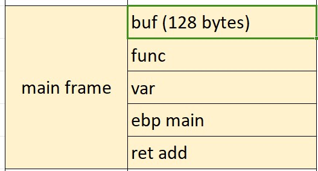
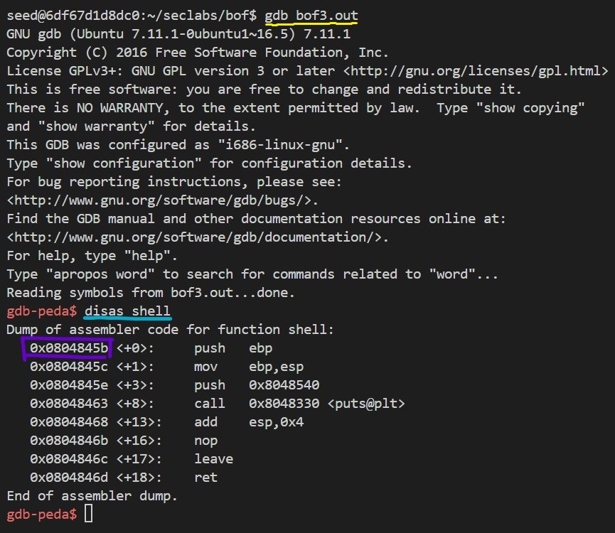
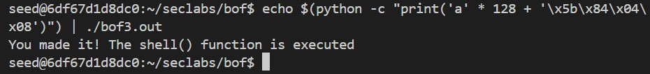

# BUFFER OVER FLOW 3
> Target: Print "You made it! The shell() function is executed".
```
#include <stdio.h>
#include <stdlib.h>
#include <sys/types.h>

void shell() {
    printf("You made it! The shell() function is executed\n");
}

void sup() {
    printf("Congrat!\n");
}

void main()
{ 
    int var;
    void (*func)()=sup;
    char buf[128];
    fgets(buf,133,stdin);
    func();
}
```

### Step 1: Analyze the code.
This task is a combination of **bof1** and **bof2**.  

As we can see this program has the same error like the program in **bof2**, that the **fgets()** function gets the user's input more than size of the *buf*. Attacker can make use of this to change internal variable's data.

Our aim is to display "You made it! The shell() function is executed" onto screen. So the 1st idea is we can depath the code flow to **shell()** function.  
But we can't do that as the **fgets()** here only allow 133 bytes input, so we need to find another way.

Luckily the programmer use a function pointer that declared just right above the buf in the stack frame. The function pointer furthermore calls the function that it's pointing to. So we can point it into the **shell()** function to achieve what we want.

### Step 2: Conduct the attack.
Here's the stack frame:



Our aim is to overflow the *buf* memory so that the *func*'s data will be adjusted to **shell()**  address.  
Now I will find the **shell()** address by load the program into **gdb** (yellow underline) and **disas** (blue underline) the **shell()**.



As you can see, the **shell()** address is boxed in a purple rectangle.

Needed informations are ready, now we will conduct a command to attack. We will need 128 bytes to fill *buf* area, and next 4 bytes is the **shell()** address. Here's the command:
    
    echo $(python -c "print('a' * 128 + '\x5b\x84\x04\x08')") | ./bof3.out

### Step 3: Attack.
We made it!!

